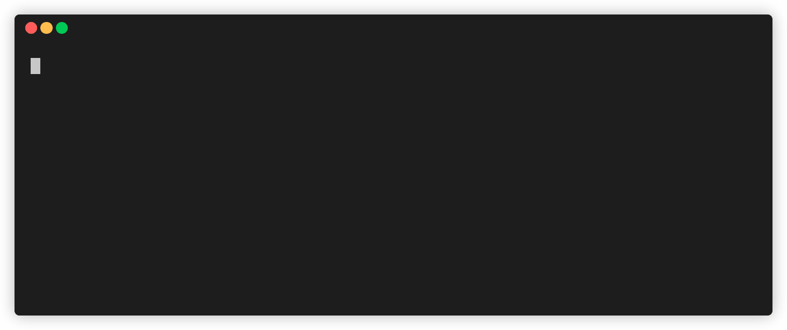

# Custom - Command
Tired of opening projects by searching through nested folders. Save projects in your terminal and open from anywhere in your preferred editor with just one command. Save websites in terminal and open with ease. 




## Requirements
Nothing much, you must just have [npm](https://www.npmjs.com/) installed in your machine.

## Installation
Install using the following command in the terminal.

```
    npm i -g custom-command
```

Note: After installation, you can use, **custom-command** or **cc** anywhere in your terminal to ensure whether it has been installed or not.
    
## Usage

### Add/Save projects
Use the following command in your terminal to add/save new projects, websites, and custom commands.

    custom-command add
    
Alternatively, you can also use the following to make the process even faster. 

    cc add
    
You can always use either **custom-command** or **cc**.


This will prompt the user for the name with which you would like to save the current directory/project. Once you enter the name, your project will be saved and will be accessible from anywhere using terminal.

Initially, it will ask the user to select for their choice of editor, in which it will open the project every time. Choose your choice and continue.


### Add/Save Websites

To save website add **-u** or **--url** at the end.

```
    cc add -u
```

### Add/Save custom commands

To save custom command at **-c** or **--custom**  at the end.

```
    cc add -c
```

-----------------

### Open 
Now once you have saved your project, it's time to open the projects using the terminal, no matter what your [pwd](https://en.wikipedia.org/wiki/Working_directory) is.

Use the following command to open your project:

```
    cc open
```

This will show the list of all the projects, websites, and custom commands which are already saved. Select the project to open.

You can also specify the name of the project which you want to open.
For example,
```
    cc open [project-Name]
```

This will directly open the project in your project/ website in your preferred editor/ browser.

----------------

### Delete project
To delete an existing project, use the following command.

```
    cc delete
```   
This will list all the saved projects. Select the project which you want to delete.

----------------

### Set editor
To set/change the default editor for your projects, use the following command.

```
    cc seteditor
```

 Choose from the list of available editors to change/set it.

-----------------------

### Remove editor
To delete the default editor for your projects, use the following command.

```
    cc rmeditor
```

-----------------------

### Remove browser
To delete the default browser to open websites, use the following command.

```
    cc rmbrowser
```


 ------------


